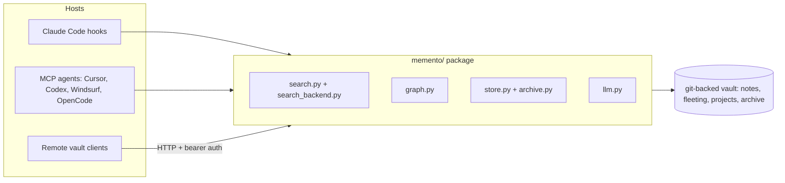

# Architecture

The `memento/` package is agent-agnostic.
Modules handle config, search, graph algorithms, vault I/O, LLM abstraction, and type definitions.
Hooks and MCP tools are thin wrappers around this package.

## Module map

```
memento/
  config.py          Configuration, project detection, vault identity
  search.py          Search pipeline: PRF, RRF, temporal decay, PageRank
  search_backend.py  Abstract search backend (QMD, Embedded, Grep -- auto-detected)
  embedded_search.py Built-in search: SQLite FTS5 + sqlite-vec vectors, RRF hybrid
  embedding.py       Embedding providers: local nomic-embed-text, Voyage, OpenAI, Google
  indexer.py         Background indexer for files added outside the write path
  graph.py           Wikilink graph, PageRank, PPR expansion
  store.py           Vault I/O, write locking, dedup, note writing, durability tier
  archive.py         Auto-archive sweep and fleeting-note lifecycle sweep
  llm.py             5 backends: claude, codex, gemini, anthropic-api, openai-compat
  auth.py            Pluggable auth (bearer token, extensible to per-user)
  remote_client.py   HTTP client for hooks talking to a remote vault
  utils.py           Secret sanitization, tag normalization
  types.py           TypedDict definitions (SearchResult, NoteMetadata, SessionMeta)
  adapters/          Transcript parsing (Claude adapter, pluggable for others)
  mcp_server.py      MCP server (read/lifecycle/write/maintenance tools, stdio + HTTP transport)
```

## Request flow



## LLM backend

LLM backend is configurable:

```yaml
llm_backend: claude        # claude, codex, gemini, anthropic-api, openai-compat
llm_model: sonnet          # model name for the chosen backend
llm_max_tokens: 4096       # API backend output cap
llm_api_retries: 3         # retries for retryable API failures
claude_bare_headless: false # opt into Claude Code --bare for detached workers
```

`claude_bare_headless: true` is the hardened mode for headless Claude workers.
It skips hook/plugin/skill discovery and requires API-key or `apiKeyHelper` auth.

## Related

- [How it works](how-it-works.md) -- capture and retrieval lifecycle in detail
- [Configuration](configuration.md) -- every tunable knob
- [Search backends](search-backends.md) -- QMD, Embedded, and Grep in depth
